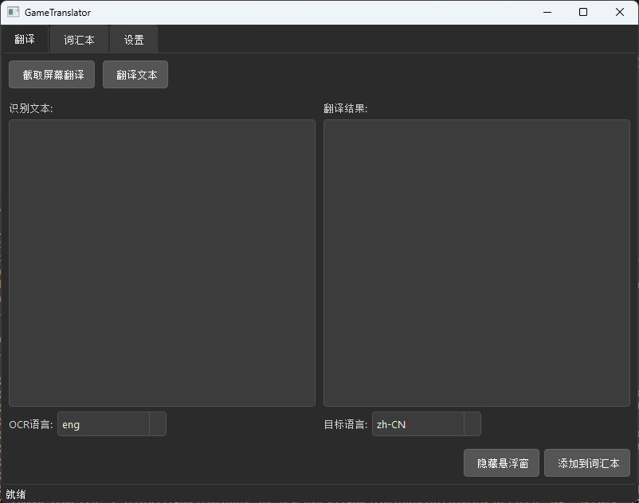
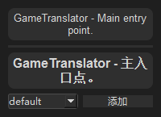
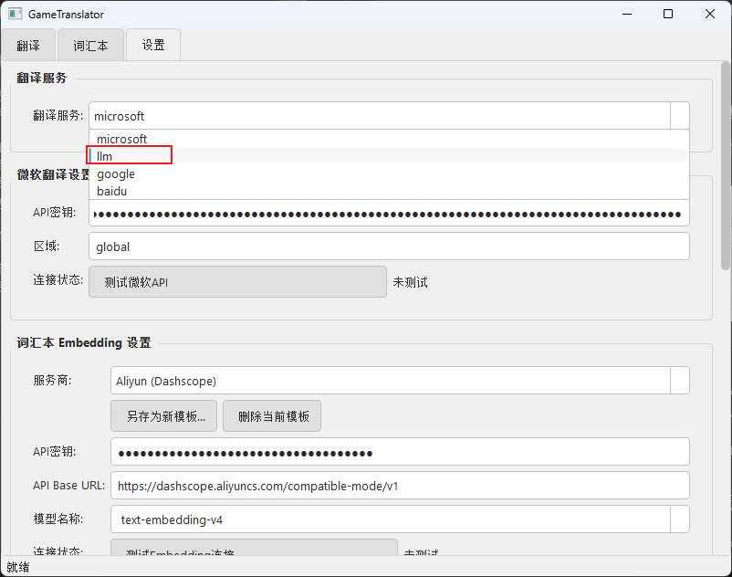
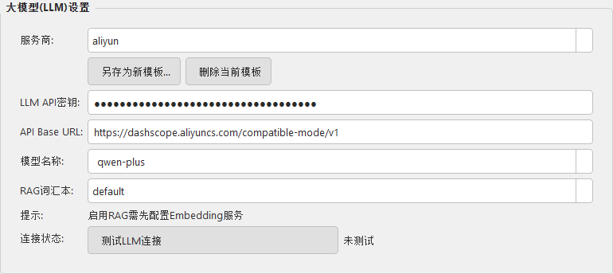
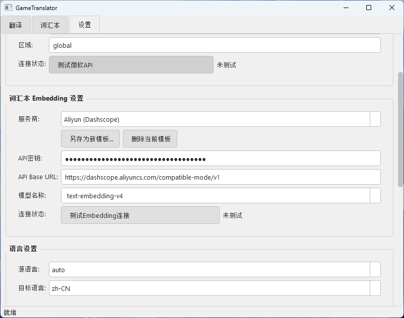
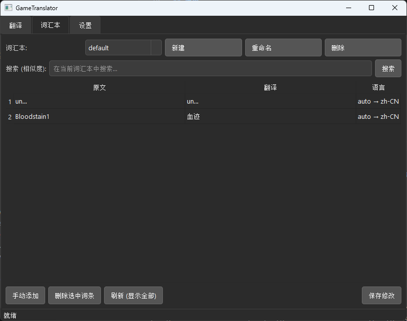
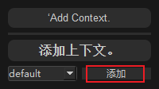
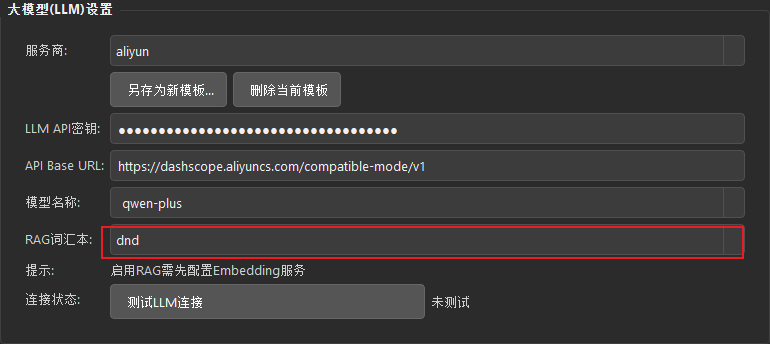
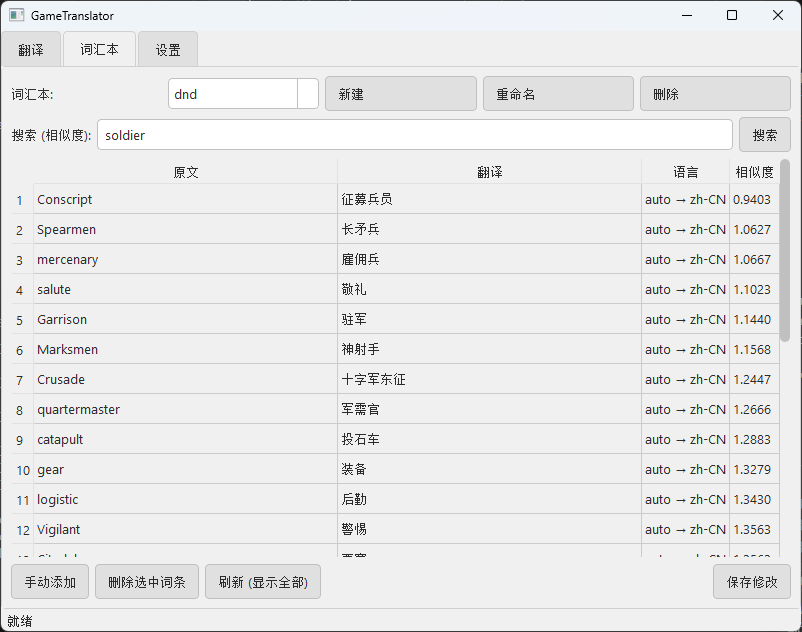

# GameTranslator
GameTranslator 是一款专为游戏场景设计的桌面翻译工具.作者使用其他翻译软件截屏翻译游戏内容时总会返回桌面,所以写了此项目.并可以创建词汇本,将词汇本用于大模型翻译.

## 安装
`git clone `
打开项目根目录, 
使用: 
`pip install -r pyproject.toml`
(推荐 使用uv)若已安装uv, 使用: 
`uv sync`

然后运行main.py
`python main.py`
(若使用uv):
`uv run main.py`

## 使用
### 使用微软翻译api
点击设置页面,选择microsoft,填写自己的apikey,或者使用作者提供的apikey

>**填写后一定要点击下方的保存按钮!!!**

### 截屏翻译
`alt+q`进行截图,鼠标左键选择区域,会弹出悬浮窗显示翻译内容,双击关闭悬浮窗 

### 使用大模型翻译
只有使用大模型翻译,才能够让大模型借助词汇本进行翻译,使用微软翻译api则不行.
>作者同样提供了llm模型和embedding模型的apikey,如果用户没有对应apikey,可以使用.(作者生活不易,请节制使用)
#### 配置大模型api
配置大模型apikey，并填入正确模型，可以使用大模型进行翻译
>若没有你所需要的服务商选项,请使用`openai`,并按照你的服务商修改`Base Url`以及模型名称

选择合适的llm并填写

>**填写后一定要点击下方的保存按钮!!!**
#### 自己配置embedding模型apikey
配置embedding模型可以使用词汇本功能

>若没有你所需要的服务商选项,请使用`openai`,并按照你的服务商修改`Base Url`以及模型名称

>对设置进行修改后,一定要**点击最下方的保存**,不然不会生效!!!
### 词汇本使用
#### 创建词汇本
点击词汇本页,创建即可

#### 将词汇添加到词汇本
悬浮窗弹出后，可以选择将词汇和翻译加入到已经创建的词汇本中。

也可以在UI界面手动添加或修改词汇内容
#### 选择词汇本并用于大模型翻译
在`大模型(LLM) 设置`框中,选择大模型翻译使用的词汇本,**并点击最下方的保存**

#### 选择词汇
|操作方式|作用|
|:-|:-|
|`left`(点击鼠标左键)|选中词汇|
|`ctrl+left`(一直按住ctrl,连续点击多个词汇)|多选|
|`shift+left`|从最顶部词汇包括到点击的词汇|

#### 搜索
按照相似度(可理解为词义的相近程度)排序,需要配置好embedding模型使用

